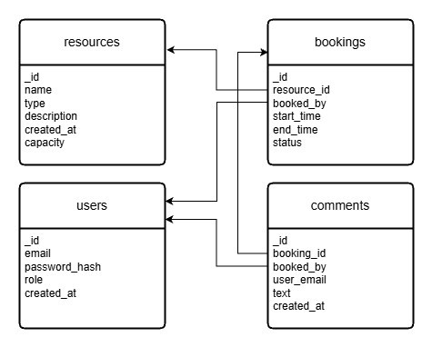

# Proxmox Booking HT26

Ett bokningssystem för resurser
(t.ex. virtuella maskiner i Proxmox), byggt med Express och MongoDB

# dv1677-ht26-grupp6-backend

## Gruppmedlemmar

| Namn | GitHub |
|------|--------|
| Johanna Johansson | @jojjan-johansson |
| Rebecka Corell | @beckabeckis |

## Projektval

Vi har valt  **bokningssystem**

Motivering:

Vi valde projektet bokningssystem för det verkade som ett intressant projekt och något som kan komma
till nytta att kunna i framtida yrken.

## Teknikval

**Frontend-ramverk:** React

Motivering:

Vi valde React dels för att vi båda har jobbat i det innan men också för att det är 
väldigt vanligt. Vi tror att det är det ramverket vi kommer att ha mest nytta av i framtiden.

## Kör lokalt

```bash
git clone git@github.com:beckabeckis/dv1677-ht26-grupp6-backend.git
cd dv1677-ht26-grupp6-backend
cp .env.example .env
npm install
npm start
```

Öppna sedan `http://localhost:3000`


## Tester

För att köra tester kör kommandot:

> ```npm test```

Testar tre olika typer av routes:
- GET: hämta alla resurser
- POST: lägga till en ny resusrs
- DELETE: ta bort en resurs

Detta testas för att se att databasen är kopplad korrekt, det går att hämta, ändra och ta bort data korrekt och routsen fungerar som planerat.

## Driftsatt

- Frontend: [https://jojjan-johansson.github.io/dv1677-ht26-grupp6-frontend/](https://jojjan-johansson.github.io/dv1677-ht26-grupp6-frontend/)
- Backend: [https://dv1677-geordi.nplab.bth.se/](https://dv1677-geordi.nplab.bth.se/)


## Tillvägagångssätt

Dokumentera löpande vad ni gjort och hur ni löst problem.

- Vecka 1-2: 

Diskuterat och bestämt vilket projekt och vilket ramverk vi kommer jobba med i kursen.
Vi har haft tre möten där vi har diskuterat uppgiften, t.ex. hur vi skulle göra PUT-route då det inte var så tydligt i 
instruktionerna hur man skulle lösa den delen. Vi mailade läraren om hjälp och löste sedan uppgiften.

- Vecka 3:

Vi jobbade med databasen, migrerade från SQLite till MongoDB.
Skapade seed.js fil som byggde upp databasen med data.
Tog bort alla vyer och skrev om app.js till att endast hantera ett JSON api.

- Vecka 4:

Kopplade oss till VPS med SSH-nycklar.
Skrev git workflow filerna ci.yml och deploy.yml och driftsatte projektet i github.

- Vecka 5:

Utökade dokumenten i MongoDB och la till fler routes.
Installerade Vite och Supertest och skrev om app.js och la till server.js så att testerna skulle fungera.
Skrev tester till tre routes; GET, POST och DELETE resources.-


## Env-variabler

`PORT` - porten som Express lyssnar på -> `3000`

`MONGODB_URI` - uri för att koppla dig till databasen -> `mongodb://localhost:27017`

`DATABASE_NAME` - namn på databas -> `resourcebooking`

## Teknikstack

- [Node](https://nodejs.org)
- [Express](https://expressjs.com)
- [MongeDB](https://www.mongodb.com/)
- [React](https://react.dev/)
- [Vite](https://vite.dev/)

## MongoDB 

Projektet använder databasen MongoDB som en docker-container i en VPS-server.

GitHub secrets:

- VPS_HOST — IP-adressen till vår VPS.
- VPS_USER — Linux-användaren på VPS (ubuntu).
- VPS_SSH_KEY — privat del av vår deploy-nyckel.
- MONGODB_URI — anslutningssträng till databasen. Docker-container på VPS: mongodb://mongodb:27017.

# Datamodell




